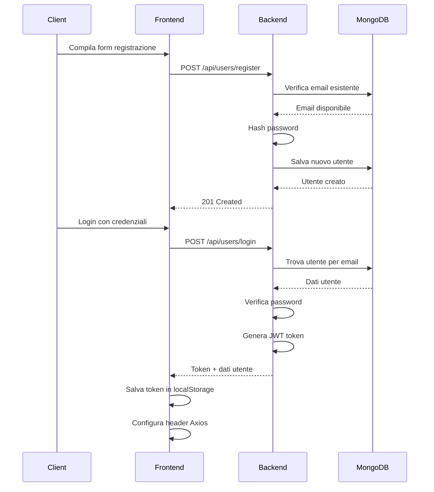
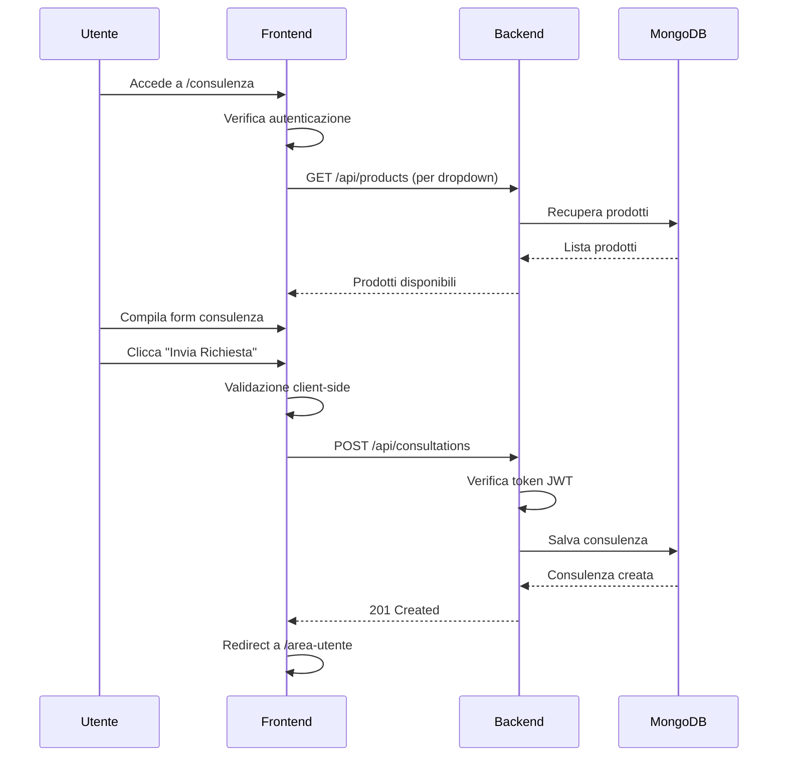
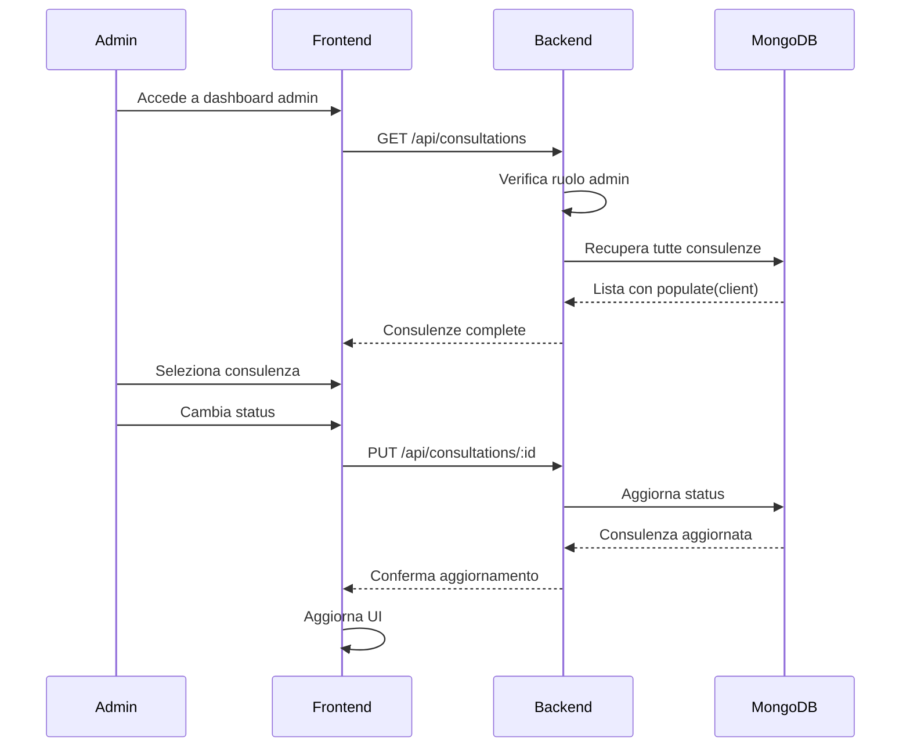
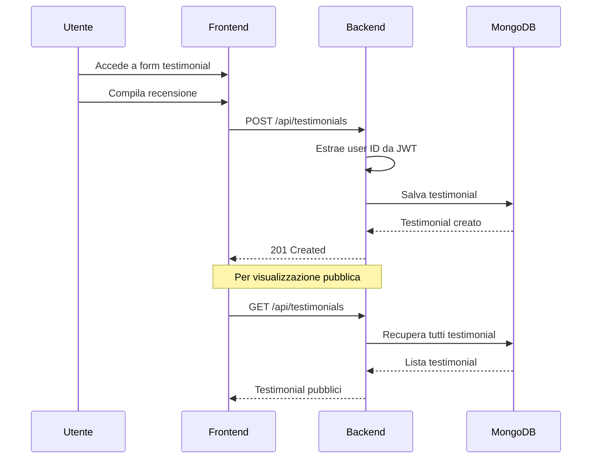

# LogiService - Documentazione Tecnica Completa

## Indice
1. [Panoramica del Sistema](#panoramica-del-sistema)
2. [Architettura Generale](#architettura-generale)
3. [Backend - Struttura e Funzionamento](#backend)
4. [Frontend - Componenti e Logica](#frontend)
5. [Database - Modelli e Relazioni](#database)
6. [API Reference](#api-reference)
7. [Autenticazione e Autorizzazione](#autenticazione)
8. [Flussi di Lavoro Principali](#flussi-di-lavoro)
9. [Configurazione e Deployment](#configurazione)

---

## Panoramica del Sistema

**LogiService** è una piattaforma web per la gestione di consulenze nel settore logistico. Il sistema permette a clienti di richiedere consulenze per scaffalature industriali e agli amministratori di gestire tali richieste.

### Caratteristiche Principali
- **Gestione Utenti**: Registrazione/login con ruoli (client/admin)
- **Catalogo Prodotti**: Scaffalature industriali con specifiche tecniche
- **Sistema di Consulenze**: Richieste personalizzate con workflow di gestione
- **Testimonial**: Sistema di recensioni e feedback
- **Dashboard Admin**: Pannello di controllo per amministratori

### Stack Tecnologico
- **Backend**: Node.js + Express.js + MongoDB + Mongoose
- **Frontend**: React.js + Material-UI + React Router + Axios
- **Autenticazione**: JWT (JSON Web Tokens)
- **Database**: MongoDB con collezioni strutturate

---

### Struttura delle Directory
```
logi-service/
├── backend/
│   ├── index.js              # Entry point del server
│   ├── middleware/
│   │   └── auth.js           # Middleware JWT
│   ├── models/               # Schemi MongoDB
│   │   ├── user.js
│   │   ├── product.js
│   │   ├── consultation.js
│   │   └── testimonial.js
│   ├── controllers/          # Logica business
│   │   ├── userController.js
│   │   ├── productController.js
│   │   ├── consultationController.js
│   │   └── testimonialController.js
│   └── routes/               # Route definitions
│       ├── userRoutes.js
│       ├── productRoutes.js
│       ├── consultationRoutes.js
│       └── testimonialRoutes.js
└── frontend/
    └── src/
        ├── App.js            # Componente root
        ├── components/       # Componenti riutilizzabili
        ├── contexts/         # Context providers
        └── pages/            # Pagine dell'applicazione
```

---

## Backend

### Entry Point (index.js)

Il server Express viene configurato con:

```javascript
// Importazioni principali
const express = require('express');
const mongoose = require('mongoose');
const cors = require('cors');
const dotenv = require('dotenv');

// Configurazione middleware globali
app.use(cors());                    // Gestione CORS
app.use(express.json());            // Parsing JSON

// Routing strutturato
app.use('/api/users', userRoutes);
app.use('/api/products', productRoutes);
app.use('/api/consultations', consultationRoutes);
app.use('/api/testimonials', testimonialRoutes);

// Connessione MongoDB e avvio server
mongoose.connect(process.env.MONGODB_URI);
app.listen(3000);
```

### Middleware di Autenticazione (auth.js)

Sistema di autenticazione JWT flessibile con controllo ruoli:

```javascript
module.exports = (role) => {
  return (req, res, next) => {
    // Estrazione token dall'header Authorization
    const authHeader = req.headers.authorization;
    const token = authHeader.split(' ')[1]; // "Bearer TOKEN"
    
    // Verifica e decodifica JWT
    const decoded = jwt.verify(token, process.env.JWT_SECRET);
    req.user = decoded; // { id, role }
    
    // Controllo autorizzazione (opzionale)
    if (role && req.user.role !== role) {
      return res.status(403).json({ error: 'Non autorizzato' });
    }
    
    next();
  };
};

// Utilizzo:
// auth()         -> Solo autenticazione
// auth('admin')  -> Richiede ruolo admin
```

### Controllers - Logica Business

#### UserController
**Responsabilità**: Gestione completa degli utenti

```javascript
// Registrazione con hashing password
const register = async (req, res) => {
  const { name, email, password, role } = req.body;
  
  // Controllo duplicati
  const existing = await User.findOne({ email });
  if (existing) return res.status(400).json({ error: 'Email già registrata' });
  
  // Hash sicuro della password
  const passwordHash = await bcrypt.hash(password, 10);
  const user = new User({ name, email, passwordHash, role });
  await user.save();
};

// Login con JWT generation
const login = async (req, res) => {
  const { email, password } = req.body;
  const user = await User.findOne({ email });
  
  // Verifica credenziali
  if (!user || !(await user.verifyPassword(password))) {
    return res.status(401).json({ error: 'Credenziali non valide' });
  }
  
  // Generazione JWT
  const token = jwt.sign(
    { id: user._id, role: user.role }, 
    process.env.JWT_SECRET, 
    { expiresIn: '7d' }
  );
  
  res.json({ token, user: userData });
};
```

**Funzionalità Admin**:
- `getAllUsers()`: Lista completa utenti
- `getUsersByRole(role)`: Filtro per ruolo
- `updateUser(id)`: Modifica dati utente
- `deleteUser(id)`: Eliminazione utente

#### ProductController
**Responsabilità**: Gestione catalogo prodotti

```javascript
// Creazione prodotto
const createProduct = async (req, res) => {
  const product = new Product(req.body);
  await product.save();
  res.status(201).json(product);
};

// Recupero prodotti con logging
const getProducts = async (req, res) => {
  console.log('getProducts - richiesta ricevuta');
  const products = await Product.find();
  res.json(products);
};
```

**CRUD Completo**:
- `POST /`: Creazione
- `GET /`: Lista tutti
- `GET /:id`: Dettaglio singolo
- `PUT /:id`: Aggiornamento
- `DELETE /:id`: Eliminazione

#### ConsultationController
**Responsabilità**: Gestione richieste di consulenza

```javascript
// Creazione richiesta
const createRequest = async (req, res) => {
  const consultation = new ConsultationRequest({ ...req.body });
  await consultation.save();
  res.status(201).json(consultation);
};

// Lista con popolazione relazioni
const getAllRequests = async (req, res) => {
  const requests = await ConsultationRequest.find().populate('client');
  res.json(requests);
};
```

**Filtri Specializzati**:
- `getRequestsByCompanySize(size)`: Per dimensione azienda
- `getRequestsByStatus(status)`: Per stato richiesta

#### TestimonialController
**Responsabilità**: Gestione recensioni

```javascript
// Creazione con auto-associazione utente
exports.createTestimonial = async (req, res) => {
  const testimonialData = {
    ...req.body,
    client: req.user.id // Da JWT middleware
  };
  
  const testimonial = new Testimonial(testimonialData);
  await testimonial.save();
  res.status(201).json(testimonial);
};
```

### Routes - Definizione Endpoint

#### User Routes
```javascript
// Endpoint pubblici
router.post('/register', userController.register);
router.post('/login', userController.login);

// Endpoint autenticati
router.get('/me', auth(), userController.getMe);

// Endpoint admin only
router.get('/', auth('admin'), userController.getAllUsers);
router.put('/:id', auth('admin'), userController.updateUser);
router.delete('/:id', auth('admin'), userController.deleteUser);
```

#### Product Routes
```javascript
// CRUD senza autenticazione (catalogo pubblico)
router.post('/', controller.createProduct);
router.get('/', controller.getProducts);
router.get('/:id', controller.getProductById);
router.put('/:id', controller.updateProduct);
router.delete('/:id', controller.deleteProduct);
```

#### Consultation Routes
```javascript
// Tutti endpoint pubblici (gestione interna dell'autenticazione)
router.post('/', controller.createRequest);
router.get('/', controller.getAllRequests);
router.get('/company-size/:companySize', controller.getRequestsByCompanySize);
router.get('/status/:status', controller.getRequestsByStatus);
```

#### Testimonial Routes
```javascript
// Creazione richiede autenticazione
router.post('/', auth(), controller.createTestimonial);
// Lettura pubblica
router.get('/', controller.getTestimonials);
```

---

## Frontend

### Struttura React e Routing

#### App.js - Configurazione Root
```javascript
function App() {
  return (
    <AuthProvider>           {/* Context globale autenticazione */}
      <Router>               {/* React Router setup */}
        <AppContent />       {/* Componente principale */}
      </Router>
    </AuthProvider>
  );
}

function AppContent() {
  return (
    <>
      <Topbar />             {/* Barra superiore con login/logout */}
      <Navbar />             {/* Navigazione principale */}
      <Routes>
        {/* Route pubbliche */}
        <Route path="/" element={<Home />} />
        <Route path="/prodotti" element={<ProdottiList />} />
        
        {/* Route protette */}
        <Route path="/area-utente" element={
          <ProtectedRoute><AreaUtente /></ProtectedRoute>
        } />
        
        {/* Route admin */}
        <Route path="/admin/consultazioni" element={
          <AdminRoute><ConsultazioniList /></AdminRoute>
        } />
      </Routes>
    </>
  );
}
```

#### Componenti di Protezione Route
```javascript
// Route che richiede autenticazione
function ProtectedRoute({ children }) {
  const { user } = useAuthContext();
  return user ? children : <Navigate to="/" />;
}

// Route che richiede ruolo admin
function AdminRoute({ children }) {
  const { user } = useAuthContext();
  return user && user.role === 'admin' ? children : <Navigate to="/" />;
}
```

### Context di Autenticazione (AuthContext.jsx)

**Responsabilità**: Gestione stato globale autenticazione

```javascript
export function AuthProvider({ children }) {
  const [user, setUser] = useState(null);
  const [token, setToken] = useState(localStorage.getItem('token'));
  const [loading, setLoading] = useState(true);

  // Inizializzazione automatica al caricamento
  useEffect(() => {
    const initAuth = async () => {
      if (token) {
        try {
          // Configurazione header globale Axios
          axios.defaults.headers.common['Authorization'] = `Bearer ${token}`;
          
          // Verifica validità token
          const res = await axios.get('/api/users/me');
          setUser(res.data);
        } catch (error) {
          // Token scaduto/invalido - cleanup
          localStorage.removeItem('token');
          setToken(null);
          setUser(null);
          delete axios.defaults.headers.common['Authorization'];
        }
      }
      setLoading(false);
    };

    initAuth();
  }, [token]);

  // Metodi di autenticazione
  const login = async (email, password) => {
    const res = await axios.post('/api/users/login', { email, password });
    const { token: newToken, user: userData } = res.data;
    
    // Persistenza locale e configurazione Axios
    setToken(newToken);
    localStorage.setItem('token', newToken);
    axios.defaults.headers.common['Authorization'] = `Bearer ${newToken}`;
    setUser(userData);
    
    return userData;
  };

  const logout = () => {
    setToken(null);
    setUser(null);
    localStorage.removeItem('token');
    delete axios.defaults.headers.common['Authorization'];
  };
}
```

### Componenti Principali

#### Navbar.jsx - Navigazione Principale
```javascript
const Navbar = () => {
  const { user } = useAuthContext();
  const location = useLocation();
  const isAdmin = user && user.role === 'admin';

  const menuItems = [
    { label: 'Home', path: '/', icon: <Home /> },
    { label: 'Prodotti', path: '/prodotti', icon: <Inventory /> },
    { label: 'Consulenza', path: '/consulenza', icon: <Support /> },
    { label: 'Recensioni', path: '/recensioni', icon: <Star /> },
    { label: 'Contatti', path: '/contatti', icon: <ContactPhone /> },
  ];

  // Logica di evidenziazione path attivo
  const isActivePath = (path) => {
    if (path === '/') return location.pathname === '/';
    return location.pathname.startsWith(path);
  };
}
```

#### LoginDialog.jsx & RegisterDialog.jsx
**Modalità**: Dialog Material-UI per autenticazione

```javascript
// Gestione form login
const handleSubmit = async (e) => {
  e.preventDefault();
  try {
    await login(email, password);
    onClose(); // Chiudi dialog
    // Redirect automatico gestito da AuthContext
  } catch (error) {
    setError(error.message);
  }
};
```

### Pagine Principali

#### AreaUtente.jsx - Dashboard Utente
**Responsabilità**: Pannello controllo personalizzato per ruolo

```javascript
const AreaUtente = () => {
  const { user } = useAuthContext();
  const [userConsultations, setUserConsultations] = useState([]);
  const [userTestimonials, setUserTestimonials] = useState([]);
  const [allConsultations, setAllConsultations] = useState([]);

  const fetchUserData = async () => {
    // Fetch consulenze utente
    const consultationsRes = await axios.get('http://localhost:3000/api/consultations');
    const userConsults = consultationsRes.data.filter(c => c.client?._id === user._id);
    setUserConsultations(userConsults);

    // Fetch testimonial utente
    const testimonialsRes = await axios.get('http://localhost:3000/api/testimonials');
    const userTestims = testimonialsRes.data.filter(t => t.client?._id === user._id);
    setUserTestimonials(userTestims);

    // Se admin, fetch tutte le consulenze
    if (user.role === 'admin') {
      setAllConsultations(consultationsRes.data);
    }
  };
}
```

**Sezioni per Utenti Standard**:
- Profilo utente con statistiche
- Lista consulenze personali
- Lista testimonial personali

**Sezioni Aggiuntive per Admin**:
- Dashboard con metriche globali
- Gestione tutte le consulenze
- Controlli amministrativi

#### Consulenza.jsx - Form Richiesta Consulenza
**Responsabilità**: Acquisizione richieste consulenza

```javascript
// Validazione e invio form
const handleSubmit = async (e) => {
  e.preventDefault();
  
  if (!user) {
    setError('Devi essere autenticato per inviare una richiesta');
    return;
  }

  try {
    const consultationData = {
      client: user._id,
      companySize,
      location,
      message,
      product: selectedProduct || undefined
    };
    
    await axios.post('http://localhost:3000/api/consultations', consultationData);
    // Reset form e redirect
  } catch (error) {
    setError('Errore durante l\'invio della richiesta');
  }
};
```

#### ProdottiList.jsx - Catalogo Prodotti
**Responsabilità**: Visualizzazione catalogo con filtri

```javascript
const fetchProducts = async () => {
  try {
    const response = await axios.get('http://localhost:3000/api/products');
    setProducts(response.data);
  } catch (error) {
    console.error('Errore nel caricamento prodotti:', error);
  }
};

// Filtri dinamici
const filteredProducts = products.filter(product => {
  return (!typeFilter || product.type === typeFilter) &&
         (!capacityFilter || product.loadCapacityKg >= capacityFilter);
});
```

---

## Database

### Schema MongoDB

#### User Model
```javascript
const userSchema = new mongoose.Schema({
  name: { type: String, required: true },
  email: { type: String, unique: true, required: true },
  passwordHash: { type: String, required: true },
  role: {
    type: String,
    enum: ['admin', 'client'],
    default: 'client'
  },
  createdAt: { type: Date, default: Date.now }
});

// Metodo istanza per verifica password
userSchema.methods.verifyPassword = function (password) {
  return bcrypt.compare(password, this.passwordHash);
};
```

#### Product Model
```javascript
const productSchema = new mongoose.Schema({
  name: { type: String, required: true },
  type: { 
    type: String, 
    enum: ['portapallet', 'cantilever', 'drive-in', 'mezzanina', 'altro'] 
  },
  loadCapacityKg: Number,
  dimensions: {
    height: Number,
    width: Number,
    depth: Number
  },
  price: Number,
  description: String,
  images: [String],
  inStock: { type: Boolean, default: true },
  createdAt: { type: Date, default: Date.now }
});
```

#### Consultation Model
```javascript
const consultationRequestSchema = new mongoose.Schema({
  client: { 
    type: mongoose.Schema.Types.ObjectId, 
    ref: 'User', 
    required: true 
  },
  product: { 
    type: mongoose.Schema.Types.ObjectId, 
    ref: 'Product' 
  },
  companySize: { type: String },
  location: { type: String },
  message: { type: String },
  status: { 
    type: String, 
    enum: ['new', 'in_progress', 'completed'], 
    default: 'new' 
  },
  requestedAt: { type: Date, default: Date.now }
});
```

#### Testimonial Model
```javascript
const testimonialSchema = new mongoose.Schema({
  client: { 
    type: mongoose.Schema.Types.ObjectId, 
    ref: 'User', 
    required: true 
  },
  clientName: { type: String, required: true },
  company: String,
  message: { type: String, required: true },
  rating: { type: Number, min: 1, max: 5 },
  createdAt: { type: Date, default: Date.now }
});
```

### Relazioni Database

```
Users (1) ──────────── (N) Consultations
  │                        │
  │                        │ (0..1)
  │                        ▼
  │                    Products
  │
  │ (1)
  └─────────────── (N) Testimonials
```

**Cardinalità**:
- User : Consultation = 1:N (un utente può avere più consulenze)
- User : Testimonial = 1:N (un utente può lasciare più recensioni)
- Product : Consultation = 1:N (un prodotto può essere referenziato in più consulenze)

---

## API Reference

### Authentication Endpoints

#### POST /api/users/register
**Descrizione**: Registrazione nuovo utente

**Body**:
```json
{
  "name": "Mario Rossi",
  "email": "mario@example.com",
  "password": "password123",
  "role": "client"
}
```

**Response 201**:
```json
{
  "message": "Utente registrato"
}
```

#### POST /api/users/login
**Descrizione**: Autenticazione utente

**Body**:
```json
{
  "email": "mario@example.com",
  "password": "password123"
}
```

**Response 200**:
```json
{
  "token": "eyJhbGciOiJIUzI1NiIsInR5cCI6IkpXVCJ9...",
  "user": {
    "_id": "64f123...",
    "name": "Mario Rossi",
    "email": "mario@example.com",
    "role": "client",
    "createdAt": "2024-01-15T10:30:00.000Z"
  }
}
```

#### GET /api/users/me
**Descrizione**: Profilo utente corrente
**Auth**: Bearer Token richiesto

**Response 200**:
```json
{
  "_id": "64f123...",
  "name": "Mario Rossi",
  "email": "mario@example.com",
  "role": "client",
  "createdAt": "2024-01-15T10:30:00.000Z"
}
```

### Product Endpoints

#### GET /api/products
**Descrizione**: Lista tutti i prodotti

**Response 200**:
```json
[
  {
    "_id": "64f456...",
    "name": "Scaffale Portapallet Standard",
    "type": "portapallet",
    "loadCapacityKg": 1000,
    "dimensions": {
      "height": 200,
      "width": 100,
      "depth": 80
    },
    "price": 299.99,
    "description": "Scaffale robusto per magazzino",
    "images": ["image1.jpg"],
    "inStock": true,
    "createdAt": "2024-01-15T10:30:00.000Z"
  }
]
```

#### GET /api/products/:id
**Descrizione**: Dettaglio singolo prodotto

### Consultation Endpoints

#### POST /api/consultations
**Descrizione**: Crea nuova richiesta consulenza

**Body**:
```json
{
  "client": "64f123...",
  "companySize": "media",
  "location": "Milano",
  "message": "Necessito consulenza per magazzino 500mq",
  "product": "64f456..."
}
```

**Response 201**:
```json
{
  "_id": "64f789...",
  "client": "64f123...",
  "companySize": "media",
  "location": "Milano",
  "message": "Necessito consulenza per magazzino 500mq",
  "product": "64f456...",
  "status": "new",
  "requestedAt": "2024-01-15T10:30:00.000Z"
}
```

#### GET /api/consultations
**Descrizione**: Lista tutte le consulenze (con popolamento client)

#### GET /api/consultations/status/:status
**Descrizione**: Filtra consulenze per stato
**Parametri**: status = new|in_progress|completed

### Testimonial Endpoints

#### POST /api/testimonials
**Descrizione**: Crea nuovo testimonial
**Auth**: Bearer Token richiesto

**Body**:
```json
{
  "clientName": "Mario Rossi",
  "company": "Logistica SRL",
  "message": "Servizio eccellente, consulenza molto professionale",
  "rating": 5
}
```

#### GET /api/testimonials
**Descrizione**: Lista tutti i testimonial

---

## Autenticazione

### JWT Implementation

#### Token Structure
```javascript
// Payload JWT
{
  "id": "64f123...",      // User ID
  "role": "client",       // User role
  "iat": 1640995200,      // Issued at
  "exp": 1641600000       // Expiration (7 giorni)
}
```

#### Frontend Token Management
```javascript
// Configurazione automatica header Axios
axios.defaults.headers.common['Authorization'] = `Bearer ${token}`;

// Gestione scadenza token
try {
  const response = await axios.get('/api/users/me');
} catch (error) {
  if (error.response?.status === 401) {
    // Token scaduto - logout automatico
    logout();
  }
}
```

#### Middleware Authorization Levels
```javascript
// Uso nei routes
router.get('/public', controller.method);                    // Pubblico
router.get('/protected', auth(), controller.method);         // Solo autenticati
router.get('/admin-only', auth('admin'), controller.method); // Solo admin
```

### Password Security
```javascript
// Hashing con bcrypt (salt 10 rounds)
const passwordHash = await bcrypt.hash(password, 10);

// Verifica nel model
userSchema.methods.verifyPassword = function (password) {
  return bcrypt.compare(password, this.passwordHash);
};
```

---

## Flussi di Lavoro Principali

### 1. Registrazione e Login Utente



### 2. Richiesta Consulenza



### 3. Gestione Admin Consulenze



### 4. Sistema Testimonial



---

## Configurazione

### Variabili d'Ambiente (.env)
```bash
# Database
MONGODB_URI=mongodb://localhost:27017/logiservice

# JWT
JWT_SECRET=your-super-secret-key-here

# Server
PORT=3000
NODE_ENV=development
```

### Script Package.json

#### Backend
```json
{
  "scripts": {
    "start": "node index.js",
    "dev": "nodemon index.js"
  },
  "dependencies": {
    "express": "^4.18.0",
    "mongoose": "^7.0.0",
    "bcrypt": "^5.1.0",
    "jsonwebtoken": "^9.0.0",
    "cors": "^2.8.5",
    "dotenv": "^16.0.0"
  }
}
```

#### Frontend
```json
{
  "scripts": {
    "start": "react-scripts start",
    "build": "react-scripts build"
  },
  "dependencies": {
    "react": "^18.2.0",
    "react-router-dom": "^6.8.0",
    "@mui/material": "^5.11.0",
    "@emotion/react": "^11.10.0",
    "@emotion/styled": "^11.10.0",
    "axios": "^1.3.0"
  }
}
```

### Comandi di Avvio

```bash
# Backend (terminal 1)
cd backend
npm install
npm run dev

# Frontend (terminal 2)
cd frontend
npm install
npm start
```

### Struttura Database MongoDB
```javascript
// Collezioni create automaticamente
db.Users              // Utenti del sistema
db.Products            // Catalogo scaffalature
db.Consultations       // Richieste consulenza
db.Testimonials        // Recensioni clienti
```

---

## Considerazioni di Sicurezza

### Backend Security
- **Password Hashing**: bcrypt con 10 salt rounds
- **JWT Secret**: Chiave segreta robusta in variabili d'ambiente
- **CORS**: Configurato per domini specifici in produzione
- **Input Validation**: Mongoose schema validation
- **Role-based Access**: Middleware autorizzazione per endpoint admin

### Frontend Security
- **Token Storage**: localStorage con gestione scadenza automatica
- **Route Protection**: Controlli di autenticazione e autorizzazione
- **Error Handling**: Nessuna esposizione di dati sensibili in errori
- **HTTP Only**: In produzione considerare httpOnly cookies per JWT

### Deployment Considerations
- **Environment Variables**: Separazione configurazioni dev/prod
- **HTTPS**: Obbligatorio in produzione per sicurezza JWT
- **Database Security**: MongoDB con autenticazione e network restriction
- **Rate Limiting**: Implementare in produzione per API protection

---

## Performance e Scalabilità

### Database Optimization
- **Indexing**: Indici su email (unique), status consulenze, client references
- **Population**: Uso selettivo di populate() solo dove necessario
- **Projection**: Select specifico dei campi per ridurre payload

### Frontend Optimization
- **Code Splitting**: Lazy loading delle route non critiche
- **State Management**: Context API per stato globale, useState locale per componenti
- **Caching**: Axios può essere configurato con cache per dati statici
- **Bundle Size**: Material-UI tree shaking per ridurre bundle

### Monitoring
- **Logging**: Console logging strategico per debugging
- **Error Tracking**: Gestione errori centralizzata
- **Performance**: React DevTools per profiling componenti

---

Questa documentazione fornisce una visione completa e tecnica del sistema LogiService, dalla struttura del codice ai flussi di lavoro, dall'API reference alle considerazioni di sicurezza. È pronta per essere utilizzata per presentazioni tecniche e come riferimento per sviluppo e manutenzione.
